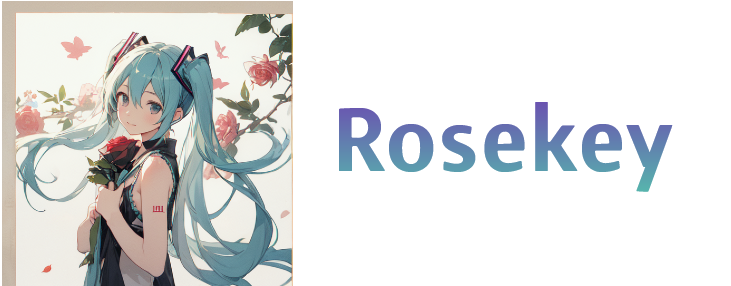

**🌎 **[Rosekey](https://misskey-hub.net/)** is an open source, decentralized social media platform that's free forever! 🚀**

---

## ✨ Features
- **ActivityPub support**\
Not on Rosekey? No problem! Not only can Rosekey instances talk to each other, but you can make friends with people on other networks like Mastodon and Misskey and Pixelfed!
- **Reactions**\
You can add emoji reactions to any post! No longer are you bound by a like button, show everyone exactly how you feel with the tap of a button.
- **Drive**\
With Rosekey's built in drive, you get cloud storage right in your social media, where you can upload any files, make folders, and find media from posts you've made!
- **Rich Web UI**\
	Rosekey has a rich and easy to use Web UI!
	It is highly customizable, from changing the layout and adding widgets to making custom themes.
	Furthermore, plugins can be created using AiScript, an original programming language.
- And much more...

## Documentation

Rosekey Documentation can be found at [Misskey Hub](https://misskey-hub.net/docs/), some of the links and graphics above also lead to specific portions of it.

## Sponsors

	

## Thanks

